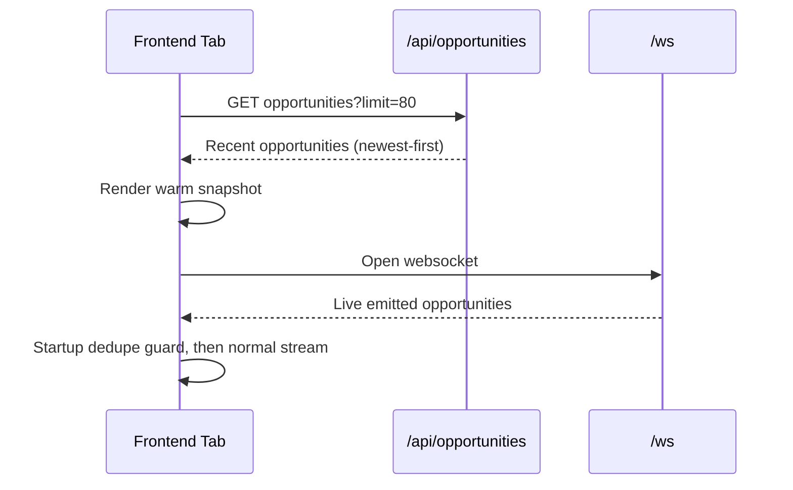

# Arbies: Low-Latency Opportunity Dedup Engine

## Overview
This project ingests live order book quotes from multiple exchanges, computes cross-venue arbitrage opportunities, suppresses duplicates in a short tick window, and serves results to frontend clients.

Recent architecture upgrades focus on low-latency deduplication and tab-switch resilience:
- Hot layer: compact-key KV cache + timing-wheel TTL suppression.
- Warm layer: in-process bounded opportunity history + warm-load API.

## Why This Design
Core requirement: stop repeated opportunity emissions without expensive per-tick work.

Design goals:
- No string-heavy hashing in hot path.
- O(1)-style lookup/insert/expiry behavior.
- No full-cache scans per tick.
- Bounded memory for replay/warm-load.
- Deterministic suppress/emit behavior.

## Runtime Architecture
```mermaid
flowchart LR
  B[Binance WS] --> Q[market_queue]
  O[OKX WS] --> Q
  C[Coinbase WS] --> Q

  Q --> L[consumer_loop]
  L --> S[update_state/get_state]
  S --> G[get_best_opportunity]
  G --> D{Dedup key in cache?}

  D -->|Yes| R[Refresh TTL slot only]
  D -->|No| E[Emit opportunity]

  E --> H[record_opportunity deque]
  E --> W[broadcast_data /ws]
  E --> P[Print ARB log line]

  API[/api/opportunities] --> H
  FE[Frontend pages] --> API
  FE --> W
```

## Hot Layer: Compact Key + KV Cache
Hot layer runs inside `consumer_loop` (`main.py`).

### Compact Key Contract
Each opportunity maps to integer tuple:
- `symbol_id`
- `buy_exchange_id`
- `sell_exchange_id`
- `price_bucket`

Computation:
- `mid_price = (sell_bid + buy_ask) * 0.5`
- `price_bucket = int(mid_price * PRICE_BUCKET_SCALE)`
- `key = (symbol_id, buy_exchange_id, sell_exchange_id, price_bucket)`

ID maps:
- `_SYMBOL_TO_ID`, `_ID_TO_SYMBOL`
- `_EXCHANGE_TO_ID`, `_ID_TO_EXCHANGE`

Rationale:
- Avoid string concatenation and string hash churn in hot dedup decision.
- Keep key construction primitive and cache-friendly.
- Bucketized price avoids fragile float-equality matching.

### KV Cache Entry
`dedup_cache: dict[key] -> [last_seen_tick, expiry_slot]`

Behavior per opportunity:
- Key exists:
  - Suppress emit.
  - Move key to refreshed expiry slot.
  - Update `last_seen_tick`.
- Key missing:
  - Insert cache entry.
  - Schedule expiry.
  - Emit once.

Emission payload normalization:
- Symbol and exchange names are restored through reverse ID maps before broadcast/log.

## Opportunity TTL: Timing Wheel (No Full Scan)
TTL uses tick-count window (`OPPORTUNITY_DEDUP_TTL_TICKS`), not wall-clock seconds.

Data structures:
- `wheel = [set() for _ in range(ttl)]`
- `tick` (monotonic per consumed market event)

Per-tick expiry:
1. `expire_slot = tick % ttl`
2. For each key in `wheel[expire_slot]`, remove key from `dedup_cache`.
3. Clear `wheel[expire_slot]`.

On refresh:
1. Remove key from old slot (`discard`).
2. Compute `new_slot = (tick + ttl) % ttl`.
3. Add key to new slot.
4. Update cache entry metadata.

```mermaid
flowchart TD
  T[Tick arrives] --> X[expire_slot = tick % ttl]
  X --> Y[Evict keys in wheel[expire_slot] from dedup_cache]
  Y --> Z[Clear wheel[expire_slot]]
  Z --> K[Compute key]
  K --> D{Key exists?}
  D -->|No| N[Insert cache entry + add to future slot + emit]
  D -->|Yes| U[Remove old slot ref + move to new slot + suppress]
```

### Complexity Profile
- Cache lookup: expected O(1).
- Insert/update: expected O(1).
- Expiry step: O(k) where `k` keys in current slot.
- No global scan across all cached keys.

## Warm Layer: History + Warm-Load
Warm layer handles UX gap when switching tabs/pages before next live tick.

### History Store
`api/server.py` maintains:
- `opportunity_history = deque(maxlen=OPPORTUNITY_HISTORY_CAPACITY)`

Write policy:
- `record_opportunity(data)` called only on newly emitted opportunities.
- History remains bounded by `maxlen` (oldest entries dropped automatically).

### Warm-Load API
Endpoint:
- `GET /api/opportunities?limit=<n>`

Rules:
- Parse `limit` as int, fallback to `OPPORTUNITY_WARMLOAD_DEFAULT_LIMIT` on invalid input.
- Clamp to `[1, OPPORTUNITY_WARMLOAD_MAX_LIMIT]`.
- Return newest-first (`reversed(deque)` then slice).

### Frontend Bootstrap Strategy
Dashboard and Live Feed pages:
1. Fetch warm history first (`/api/opportunities`).
2. Render seed rows/events.
3. Connect websocket (`/ws`) for live updates.
4. Use short startup dedupe window to avoid warm-load + immediate live duplicate rendering.



## Behavior Guarantees
- Same opportunity key emits at most once during active TTL window.
- Repeated ticks for same key are suppressed and refresh expiry.
- Opportunity naturally disappears from cache after slot expiry.
- Same key can emit again after expiry if opportunity reappears.
- Tab switch/load can show recent opportunities immediately via warm-load API.

## Configuration Knobs
From `config/settings.py`:
- `OPPORTUNITY_DEDUP_TTL_TICKS` (default `10`)
- `PRICE_BUCKET_SCALE` (default `100`)
- `OPPORTUNITY_HISTORY_CAPACITY` (default `500`)
- `OPPORTUNITY_WARMLOAD_DEFAULT_LIMIT` (default `80`)
- `OPPORTUNITY_WARMLOAD_MAX_LIMIT` (default `500`)

Tuning notes:
- Higher `OPPORTUNITY_DEDUP_TTL_TICKS`: stronger suppression, slower re-emit.
- Higher `PRICE_BUCKET_SCALE`: finer price distinctions, more unique keys.
- Higher history capacity: better warm UX, higher memory footprint.

## API and Stream Interfaces
- `GET /api/health`: service status payload.
- `GET /api/state`: current internal market state snapshot.
- `GET /api/opportunities?limit=n`: bounded warm history.
- `GET /ws`: websocket stream of newly emitted (dedup-approved) opportunities.

## Quick Start
### Prerequisites
- Python 3.10+ recommended.
- Install dependencies from `requirements.txt`.

### Run
```bash
python3 -m venv venv
source venv/bin/activate
pip install -r requirements.txt
python3 main.py
```

Expected startup logs:
- `API Server | http://127.0.0.1:8090`
- `Test Endpoints | http://127.0.0.1:8090/test.html`

### Open UI
- Dashboard: `http://127.0.0.1:8090/`
- Feed: `http://127.0.0.1:8090/feed.html`
- Status: `http://127.0.0.1:8090/status.html`
- Test page: `http://127.0.0.1:8090/test.html`

### Quick API Checks
```bash
curl -s http://127.0.0.1:8090/api/health
curl -s http://127.0.0.1:8090/api/state
curl -s "http://127.0.0.1:8090/api/opportunities?limit=20"
```

### Debug Checklist
- No opportunities visible:
  - Verify process running and websocket connected.
  - Check `/api/state` for fresh venue quotes.
  - Check symbol maps in `config/settings.py` for venue symbol mismatch.
- Too many repeated opportunities:
  - Increase `OPPORTUNITY_DEDUP_TTL_TICKS`.
  - Increase `PRICE_BUCKET_SCALE` only if keys currently too coarse.
- Warm-load empty after tab switch:
  - Confirm opportunities were emitted (look for `ARB | ...` lines).
  - Confirm `/api/opportunities` returns rows.
  - Confirm frontend page loads warm snapshot before websocket connect.

## Operational Signals
Emission log format:
- `ARB | <symbol> | BUY <exchange> @ <price> | SELL <exchange> @ <price> | Gross: ... Net: ... Net Bps: ...`

Consumer error log format:
- `CONS | <symbol> | <ErrorType>: <message>`

## Edge Cases and Safety Details
- Invalid `limit` query string falls back to default.
- Empty websocket client set exits broadcast early.
- Expiry deletion uses safe pop (`pop(..., None)`).
- Slot removal uses `discard` to avoid missing-key exceptions.
- TTL semantics tied to consumed ticks, not elapsed time.

## Validation Scenarios
Use these scenarios to verify behavior:

1. Duplicate suppression in TTL:
- Feed repeated identical opp key within < TTL ticks.
- Expect first emission only, later repeats suppressed.

2. Re-emit after expiry:
- Stop seeing key long enough for slot expiry.
- Reintroduce same key.
- Expect new emission.

3. Warm-load across tab switch:
- Open dashboard/feed, receive opportunities.
- Switch away and back with no new live ticks.
- Expect previous opportunities visible from `/api/opportunities`.

4. Warm + live overlap:
- Warm-load returns recent key, websocket sends same key immediately.
- Expect startup dedupe to prevent double render.

## Innovation Summary
- Hot path uses compact integer tuple key instead of string hash signatures.
- TTL expiry uses fixed-size timing wheel instead of full-cache sweep.
- Warm layer decouples UI continuity from live event timing.
- Combined system provides deterministic dedup behavior with bounded memory and low per-tick overhead.
